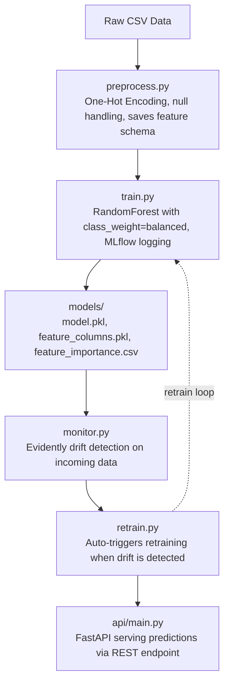

# Customer Churn Prediction — MLOps Pipeline

An end-to-end MLOps pipeline for predicting telecom customer churn using the IBM Telco dataset.
Covers data preprocessing, model training, experiment tracking, REST API serving, drift monitoring, and automated retraining.

---

## Project Architecture



---

## Model Performance

### Before Improvements (v1)
| Metric | Score |
|--------|-------|
| Accuracy | 79.18% |
| F1 Score | 0.52 |
| ROC-AUC | 0.68 |

### After Improvements (v2)
| Metric | Score |
|--------|-------|
| Accuracy | 72.85% |
| F1 Score | **0.61** |
| ROC-AUC | **0.84** |

> **Why did accuracy drop but the model improve?**
> The dataset is imbalanced — 73.4% non-churn vs 26.6% churn.
> v1 was biased toward predicting "no churn" giving misleadingly high accuracy.
> Adding `class_weight='balanced'` forced the model to actually learn churner patterns.
> F1 and ROC-AUC are the meaningful metrics here — both improved significantly.

---

## Top Features Driving Churn (from MLflow)

| Feature | Importance |
|---------|-----------|
| tenure | 0.1908 |
| Contract_Two year | 0.1519 |
| InternetService_Fiber optic | 0.0877 |
| TotalCharges | 0.0872 |
| PaymentMethod_Electronic check | 0.0736 |

> **Business insight:** New customers on month-to-month contracts, using fiber optic internet
> and paying by electronic check are the highest churn risk segment.

---

## Key Improvements Made (v1 → v2)

### 1. Fixed Preprocessing — LabelEncoder → One-Hot Encoding
**Problem:** `LabelEncoder` assigned integers (0, 1, 2) to nominal categories like
`InternetService = ["DSL", "Fiber optic", "No"]`, injecting fake ordinal relationships.
The model incorrectly learned that "No" > "Fiber optic" > "DSL".

**Fix:** Switched to `pd.get_dummies()` which creates separate binary columns per category.
Features expanded from 19 → 30 columns. Saved column schema to `feature_columns.pkl`
so inference always aligns with training.

### 2. Fixed Class Imbalance — Added class_weight='balanced'
**Problem:** 74% of samples are non-churners. Model predicted "no churn" for almost
everyone, achieving 79% accuracy while missing most actual churners (F1 = 0.52).

**Fix:** Added `class_weight='balanced'` to RandomForestClassifier. This automatically
adjusts sample weights inversely proportional to class frequency, penalizing the model
more for missing churners. F1 improved from 0.52 → 0.61, AUC from 0.68 → 0.84.

### 3. Fixed ROC-AUC Calculation
**Problem:** `roc_auc_score(y_test, preds)` was called on binary predictions (0/1)
instead of probabilities, losing threshold information and producing a less meaningful score.

**Fix:** Changed to `roc_auc_score(y_test, predict_proba(X_test)[:, 1])`.

### 4. Added Feature Importance Logging to MLflow
**Problem:** MLflow only logged accuracy, F1, and AUC. No insight into which features
drove predictions.

**Fix:** Top 10 feature importances logged as MLflow metrics. Full importance CSV saved
as MLflow artifact. Provides business-interpretable insights beyond raw metrics.

### 5. Fixed API — Accepts Human-Readable Strings
**Problem:** API required callers to send encoded integers (e.g. `InternetService: 1`)
with no documentation of the mapping. Unusable by non-technical users.
Encoders were never saved after training so the mapping was lost.

**Fix:** API now accepts string values (`InternetService: "Fiber optic"`).
Pydantic `Literal` types validate exact allowed values. Added `/health` and
`/model-info` endpoints for production monitoring.

### 6. Fixed Side-Effect Bug in train.py
**Problem:** Training code ran at module level — importing `train.py` triggered
full model training immediately as a side effect.

**Fix:** Wrapped all training logic in `train_model()` and `retrain_model()` functions.
Module is now safe to import.

### 7. Added Unit Test Suite
**Problem:** No automated verification of pipeline components.

**Fix:** 6 pytest tests covering preprocessing shape, null handling, column schema
alignment, model prediction validity, class imbalance documentation, and drift
detection contract.

```
tests/test_pipeline.py::test_preprocessing_shape          PASSED
tests/test_pipeline.py::test_no_nulls_after_preprocessing PASSED
tests/test_pipeline.py::test_feature_columns_match_schema PASSED
tests/test_pipeline.py::test_model_prediction_output      PASSED
tests/test_pipeline.py::test_class_imbalance_ratio        PASSED
tests/test_pipeline.py::test_drift_detection_returns_bool PASSED
```

---

## How to Run

### 1. Install dependencies
```bash
pip install -r requirements.txt
```

### 2. Train the model
```bash
python src/train.py
```
This generates `models/model.pkl`, `models/feature_columns.pkl`, and `models/feature_importance.csv`.

### 3. View MLflow experiments
```bash
mlflow ui
```
Open `http://localhost:5000` to compare runs, metrics, and feature importances.

### 4. Start the API
```bash
uvicorn api.main:app --reload
```
Open `http://localhost:8000/docs` for interactive API documentation.

### 5. Run drift detection + auto-retrain
```bash
python src/retrain.py
```

### 6. Run unit tests
```bash
pytest tests/test_pipeline.py -v
```

---

## API Usage

### POST /predict
```json
{
  "gender": "Female",
  "SeniorCitizen": 0,
  "Partner": "Yes",
  "Dependents": "No",
  "tenure": 12,
  "PhoneService": "Yes",
  "MultipleLines": "No",
  "InternetService": "Fiber optic",
  "OnlineSecurity": "No",
  "OnlineBackup": "Yes",
  "DeviceProtection": "No",
  "TechSupport": "No",
  "StreamingTV": "Yes",
  "StreamingMovies": "No",
  "Contract": "Month-to-month",
  "PaperlessBilling": "Yes",
  "PaymentMethod": "Electronic check",
  "MonthlyCharges": 70.35,
  "TotalCharges": 845.50
}
```

### Response
```json
{
  "churn_prediction": 1,
  "churn_probability": 0.7823,
  "interpretation": "Will churn"
}
```

---

## CI/CD Pipeline

Every push to `main` automatically:
1. Spins up a fresh Ubuntu Linux machine on GitHub
2. Installs all dependencies from requirements.txt
3. Trains the model to generate artifacts
4. Runs all 6 pytest unit tests
5. If tests pass → builds Docker image
6. If tests fail → pipeline stops, developer is notified

[](https://github.com/kowshikkkkkk/Churn---Mlops/actions/workflows/ci.yml)

---

## Known Limitations & Production Roadmap

| Limitation | Production Fix |
|------------|---------------|
| Retraining uses same original CSV | Store incoming prediction data; retrain on new data |
| Drift is simulated, not real | Use real time-windowed data (last 2 weeks vs last 3 months) |
| No model validation before deployment | Compare new model vs old before replacing |
| Manual pipeline execution | Apache Airflow DAG for scheduled drift checks and retraining |
| Single model, no experimentation | Compare XGBoost, LightGBM; use MLflow model registry for versioning |

---

## Tech Stack

| Tool | Purpose |
|------|---------|
| scikit-learn | RandomForest model training |
| pandas | Data preprocessing and feature engineering |
| MLflow | Experiment tracking, metric logging, model registry |
| FastAPI | REST API for model serving |
| Pydantic | Input validation and schema enforcement |
| Evidently | Data drift detection |
| pytest | Unit testing |
| joblib | Model and artifact serialization |
| Docker | Containerization — python:3.11-slim image |
| GitHub Actions | CI/CD — automated testing and Docker build on every push |

---

## Dataset

IBM Telco Customer Churn Dataset
- 7,043 customers, 21 features
- Target: `Churn` (Yes/No) — 26.6% churn rate
- Source: [Kaggle](https://www.kaggle.com/datasets/blastchar/telco-customer-churn)
# test
